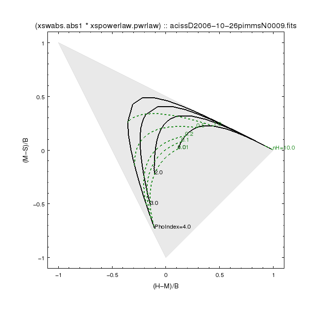
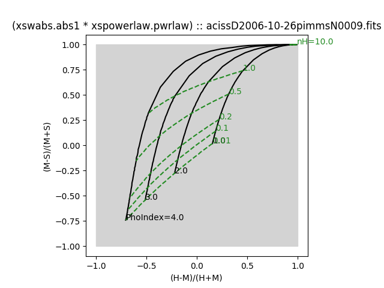

# Color-color diagram



In X-ray astronomy we usually define "color" as the hardness ratio.  

The hardness ratio is the ratio of the difference in the 
number of counts in two independent energy bands divided by the
total number of counts.  The total number of counts may be the sum of
the two energy bands, or may be the total over a wider energy range
that full encloses 

Thus defined, the hardness ratio will be between -1 and 1.   Values closer
to -1 are "soft", low energy band dominates.  Values closer to 1 are "hard",
high energy band dominates.

A color-color plot then shows the hardness ratio in 1 pair of bands along
the X-axis, and a different pair of bands along the Y-axis.


This collection of classes simulates a spectrum with the user 
specified spectral model and instrument response.  Two of the model parameters
are varied over an input grid and the color in the different 
energy bands is computed.  This grid is then plotted in the color-color
diagram.

The idea is that for a source, if you compute the colors and assume a 
spectral model shape, you can get an estimate of the model **parameters** 
by looking at the color-color diagram.


## Example

```python
from color_color import *

import sherpa.astro.ui as ui
import pychips as chips

#
# Define our energy bands
#
soft = EnergyBand( 0.5, 1.2, 'S')
medium = EnergyBand(1.2, 2.0, 'M')
hard = EnergyBand(2.0, 7.0, 'H')

#
# Define model
#
mymodel = ui.xswabs.abs1 * ui.xspowerlaw.pwrlaw
arffile = "acissD2006-10-26pimmsN0009.fits"

#
# First model parameter axis
#
pho_grid = [ 1., 2., 3., 4. ]
photon_index = ModelParameter( pwrlaw.PhoIndex, pho_grid)

#
# Second model parameter axis
# 
sg = [ 1.e20, 1.e21, 2.e21, 5.e21, 1.e22, 1e23] 
nh_grid = [x/1e22 for x in sg ]
absorption = ModelParameter( abs1.nH, nh_grid)

#
# Get to work.  
#
ao09 = ColorColor( mymodel, arffile )
matrix_09 = ao09( photon_index, absorption, soft, medium, hard, None)

#
# Setup plot styles
#
photon_index.set_curve_style("symbol.style=none line.style=solid line.thickness=2 stem=PhoIndexLine" )
photon_index.set_label_style("halign=0 valign=0 stem=PhoIndexLab")
absorption.set_curve_style("symbol.style=none line.style=shortdash line.thickness=2 line.color=forest stem=nHLine")
absorption.set_label_style("halign=0 valign=0 color=forest stem=nHLab")

chips.clear()
matrix_09.plot()
chips.print_window("color_color.png", "export.clobber=True")

```

The output looks like




Now suppose there was a source where the `(H-M)=-0.25` and `(M-S)=-0.2`.
If the assumption about the spectral model is correct, then it would 
be expected to have a photon index between 2 and 3 and absorption between 0.2 and 0.5
*10^22.
